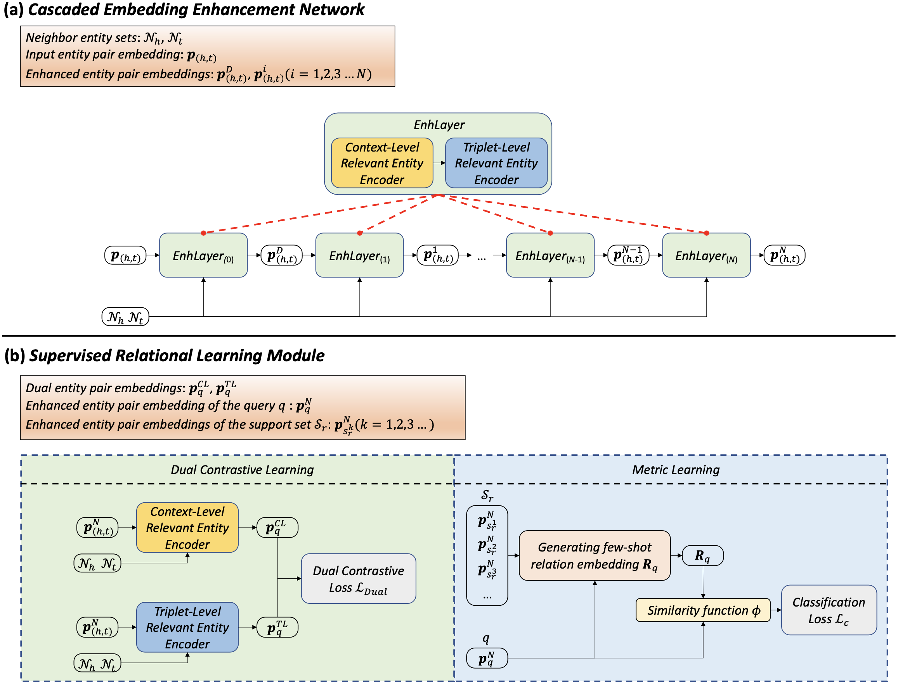

# Supervised Relational Learning with Selective Neighbor Entities for Few-Shot Knowledge Graph Completion
Source code for ISWC-2024 paper: Supervised Relational Learning with Selective Neighbor Entities for Few-Shot Knowledge Graph Completion.

Few-shot Knowledge Graph (KG) completion is a focus of current research, where each task aims at querying unseen facts of a relation given limited reference triplets. However, existing works overlook two categories of neighbor entities relevant to few-shot relations, resulting in embeddings results insufficient to high-quality few-shot KG completion. In this work, we propose a supervised relational learning model (SuperRL) with these crucial neighbor entities. Our SuperRL contains the following components: 1) **Cascaded Embedding Enhancement Network**. Multiple enhancement layers consisting of different neighbor entity encoders are used for generating entity pair embeddings enriched with the information of both directly relevant entities and indirectly relevant entities for few-shot relations 2) **Supervised Relational Learning Module**. Dual contrastive learning and metric learning provide different supervision signals with entity pair embeddings for relational learning.



## Requirements

**Step1** Create a virtual environment using `Anaconda` and enter it.

**Step2** Installing the following packages in the virtual environment：
```
python 3.6
Pytorch == 1.13.1
CUDA: 11.6
```

## Datasets

We adopt Nell-One and Wiki-One datasets to evaluate our model, SuperRL. The orginal datasets and pretrain embeddings are provided from [xiong's repo](https://github.com/xwhan/One-shot-Relational-Learning). For convenience, the datasets can be downloaded from [Nell data](https://sites.cs.ucsb.edu/~xwhan/datasets/nell.tar.gz) and [Wiki data](https://sites.cs.ucsb.edu/~xwhan/datasets/wiki.tar.gz). The pre-trained embeddings can be downloaded from [Nell embeddings](https://drive.google.com/file/d/1XXvYpTSTyCnN-PBdUkWBXwXBI99Chbps/view?usp=sharing) and [Wiki embeddings](https://drive.google.com/file/d/1_3HBJde2KVMhBgJeGN1-wyvW88gRU1iL/view?usp=sharing). All the dataset files and the pre-trained embeddings should be put into the directory ./data/NELL and ./data/Wiki, respectively.

| Dataset   | #Entities  | #Relations | #Triplets  | #Tasks |
| --------- | ---------- | ---------- | ---------- | ------ |
| Nell-One  | 68,545     | 358        | 181,109    | 67     |
| Wiki-One  | 4,838,244  | 822        | 5,859,240  | 183    |

## Model Training
For optimal performance, please train SuperRL according to the following instructions:

### Nell-One
3-shot setting:
```
python main.py --fine_tune --num_layers 2 --lamda 0.06 --lr 8e-5 --few 3 --early_stop 10 --prefix SuperRL_3_NELL
```

5-shot setting:
```
python main.py --fine_tune --num_layers 2 --lamda 0.09 --lr 8e-5 --few 5 --early_stop 10 --prefix SuperRL_5_NELL
```

### Wiki-One
3-shot setting:
```
python main.py --datapath "data/Wiki/" --num_layers 8 --lamda 0.06 --lr 2e-4 --few 3 --early_stop 10 --prefix SuperRL_3_Wiki
```

5-shot setting:
```
python main.py --datapath "data/Wiki/" --num_layers 8 --lamda 0.09 --lr 2e-4 --few 5 --early_stop 10 --prefix SuperRL_5_Wiki
```

## Model Testing

To test the trained models, please follow instructions as follows:

### Nell-One
3-shot setting:
```
python main.py --test --num_layers 2 --lr 8e-5 --prefix SuperRL_3_NELL
```

5-shot setting:
```
python main.py --test --num_layers 2 --lr 8e-5 --prefix SuperRL_5_NELL
```

### Wiki-One
3-shot setting:
```
python main.py --test --datapath "data/Wiki/" --num_layers 8 --lr 2e-4 --prefix SuperRL_3_Wiki
```

5-shot setting:
```
python main.py --test --datapath "data/Wiki/" --num_layers 8 --lr 2e-4 --prefix SuperRL_5_Wiki
```

## Argument Descriptions

Here are explanations of some important args,

```bash
--data_path: "directory of dataset"
--few:       "the number of few in {few}-shot, as well as instance number in support set"
--num_layers:    "the number of enhancement layers"
--lamda:    "the trade-off parameter for dual contrastive loss"
--prefix:    "given name of current experiment"
--fine_tune  "whether to fine tune the pre_trained embeddings"
--device:    "the GPU number"
```

Normally, other args can be set to default values. Please refer to ``args.py`` for more details about args.

## Citation
Please cite our paper if you use SuperRL in your work.
```
@inproceedings{SuperRL,
 author = {Hou, Jiewen and
           Wu, Tianxing and
           Wang, Jingting and
           Wang, Shuang and
           Qi, Guilin},
 title = {Supervised Relational Learning with Selective Neighbor Entities for Few-Shot Knowledge Graph Completion},
 booktitle = {{ISWC}},
 pages = {144--161},
 publisher = {Springer Nature Switzerland},
 date = {2025},
}
```

